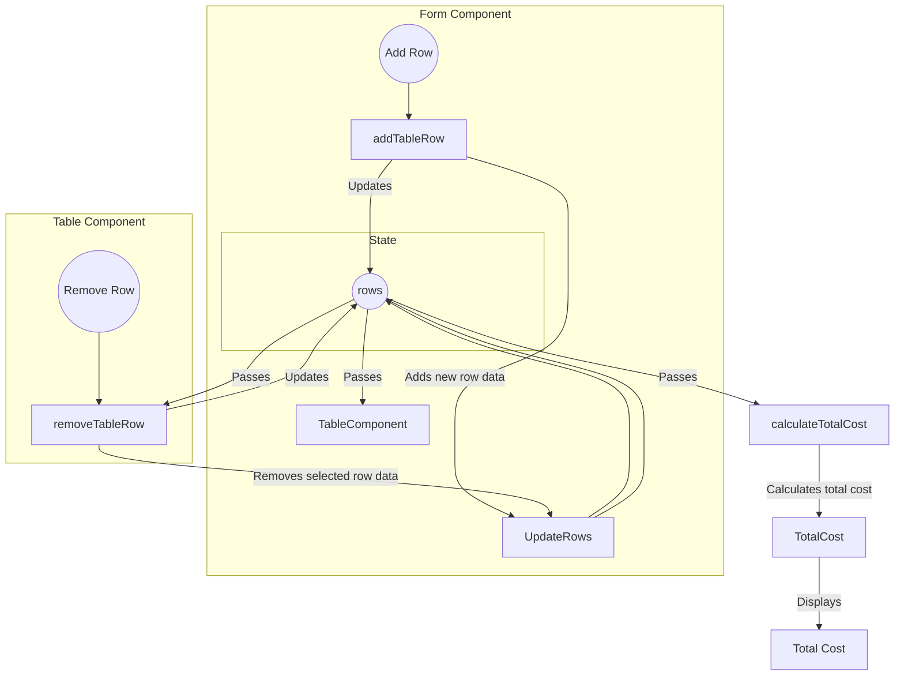

# Recipe Cost Calculator

### What it does?
This is a simple calculator for your recipes. Add the prices and the grams and see the cost of each ingredient and the sum for the complete recipe.

### The reason behind..
My brother is a chef and he wanted a tool to calculate the cost of some of the recipes that he is planning to add on his restaurant menu. 

# Connection on the two important components Form and Table

